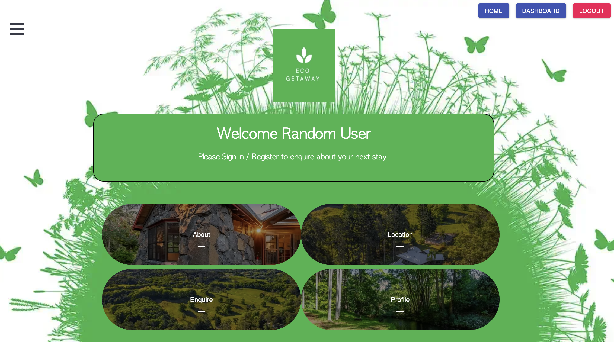
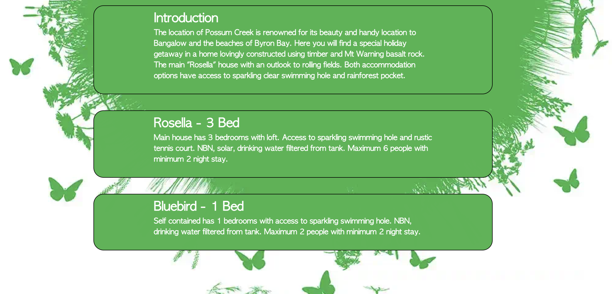
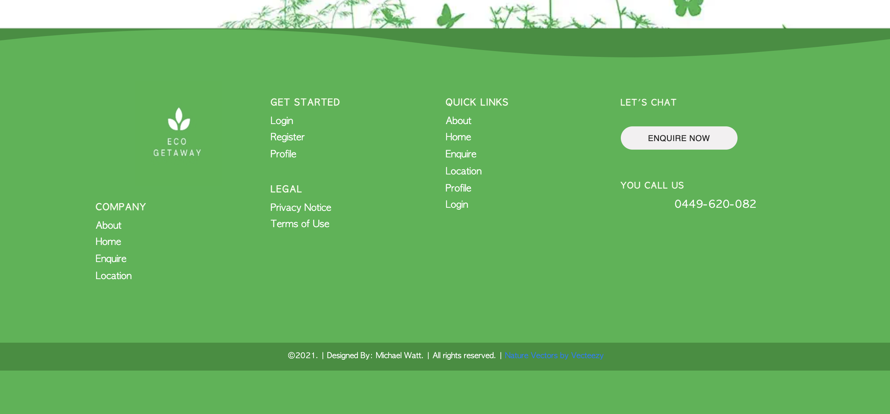

# Eco Getaway

## User Story

- You need a holiday after working so hard. Well look no further at affordable pricing and all you need for a holiday home.

### Link to the Website

[Eco Getaway](https://eco-getaway.herokuapp.com/)

## Getting Started
This repository aims to assist a user in beginning work on a MERN stack application for heroku deployment with a solid file structure as a foundation.

- A ReactJS front end that uses jwt_passport for authentication and authorization .
- A MongoDB Backend.
- App deployed directly to heroku.

Since this project will hold both the client application and the server application there will be node modules in two different places. First run `npm install` from the root. After this you will run `npm  install` from the root. Then create a `.env` file with your secret key, and MongoDB connection string. This is a script we have defined in package.json. Alternatively your group may choose to simplify this process by using yarn workspaces as specified [here](https://yarnpkg.com/lang/en/docs/workspaces/).

This app has been deployed directly to heroku since there is a script defined in package.json which will automatically handle building and deploying the app. For more information on deploying to heroku reference the extra resources at the bottom of this file.

#### Final Product

## Available Scripts

Please note that any time the server is run in these scripts `nodemon` is used in place of `node` for easier development. If you are interested in how this works follow the nodemon In the project directory, you can run:

### `npm start`

Runs both the client app and the server app in development mode. 
Open [http://localhost:3000](http://localhost:3000) to view the client in the browser.

### `react-scripts build`

If deploying to heroku this does not need to be run since it is handled by the heroku-postbuild script 

See the section about [deployment](https://facebook.github.io/create-react-app/docs/deployment) for more information.

## File structure
#### `client` - Holds the client application
- #### `public` - This holds all of our static files
- #### `src`
    - #### `assets` - This folder holds assets such as images, docs, and fonts
    - #### `components` - This folder holds all of the different components that will make up our views
    - #### `store` - Initial User check. Verifying token saved
    - #### `actions` - Decode token to get user data, Set current user
    - #### `App.js` - This is what renders all of our browser routes and different views
    - #### `index.js` - This is what renders the react app by rendering App.js, should not change
- #### `package.json` - Defines npm behaviors and packages for the client
#### `server` - Holds the server application
- #### `config` - This holds our configuration files, like mongoDB uri
- #### `Vaildation` - Convert empty fields to an empty string so we can use validator functions, password checks.
- #### `models` - This holds all of our data models
- #### `routes` - This holds all of our HTTP to URL path associations for each unique url
- #### `server.js` - Defines npm behaviors and packages for the client
#### `package.json` - Defines npm behaviors like the scripts defined in the next section of the README
#### `.gitignore` - Tells git which files to ignore
#### `README` - This file!

## Learn More
To learn how to setup a local MongoDB instance for testing, check out how to [connect to MongoDB](https://docs.mongodb.com/guides/server/drivers/).

To learn how to deploy a full-stack web app to heroku, check out [this great guide](https://daveceddia.com/deploy-react-express-app-heroku/).

To learn React, check out the [React documentation](https://reactjs.org/).

## Contents
MERN Project composed with components,  readme, package.json, public and src folder with React and license files.

## Built With

- [VScode](https://code.visualstudio.com/) - The editor of choice
- [Terminal](https://gitforwindows.org/) - What would we do without our bash?

### Licence

License under the [MIT License](LICENSE)
​
## Author

_Michael Watt_

- [Github!](https://github.com/Michaelmw17)
- [LinkedIn!](https://www.linkedin.com/in/michael-watt-6a76961b3/)
- [Portfolio!](http://michaelmw17.github.io/)
- Email:(michaelmw17@outlook.com)
​​

## Acknowledgments

To Teacher and TA's:
Ali, Jack and Sandes.

